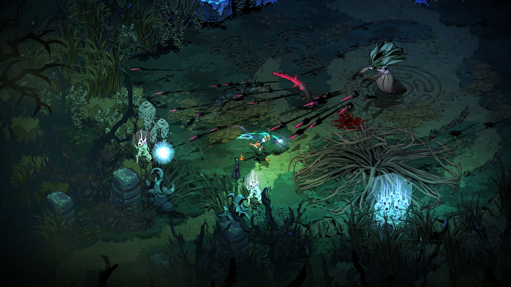

## Assignment 1: A Description of my Favorite Game

Its hard to tell what my favorite game is exactly (I'm not the most decisive person), but a lot of my favorite games fall into the roguelite category so I will talk about the most recent game I'm exited about from the genre. The game I'm going to talk about today is Hades II. The game was released into early access by [Supergiant Games](https://www.supergiantgames.com/) on May 6th of this year. Like their previous games, it was made in their own custom engine, which was rewritten during the development of their previous game, Hades. 

I played the first Hades in early access right before the beginning of the pandemic. I was already a big fan of other games the company made and of Darren Korb's music especially. Since then I've put many hours into the first game and when the game got popular enough that Supergiant decided to make a sequel I was really excited to see what that would entail, since this is the first sequel they've made. Now, since it hasn't even been a month since this came out and it's still in ea I haven't gotten too far into it, but so far the game seems just as good as the first, while also changing the formula enough that it doesn't just feel like more of the same game. I won't talk too much about specific story details since I don't want to spoil something for someone who wants to play the game eventually, but I will say that the track Coral Crown is already in my top 5 favorite songs Korb has made.

#
**Similar Games:**
- [Hades](https://www.supergiantgames.com/games/hades) - I think the reasoning is fairly obvious...
- [Transistor](https://www.supergiantgames.com/games/transistor) - Transistor has similar gameplay, and I thinkk led to the development of Hades and now it's sequel.
- [Bastion](https://www.supergiantgames.com/games/bastion) - Supergiant's first game, same reason as transistor. 
- [Risk of Rain 2](https://hopoogames.com/risk-of-rain-2/) - A wierd choice for the list, I know, but I think that these games both use the soundtrack in a way that really elevates the game experience. I also think that the lore of the stories have some fun similarities in spite of their vast diffences in setting and style.
- [Wizard of Legend](https://wizardoflegend.com/) - I wanted to include it because it is in my opinion the closest game I can think of to Hades I & II in terms of gameplay and feeling. It has been forever since playing it though, so my memory is not the most accurate.
- [Lysfanga]() - I played this at PAX East this year and it blew me away. It has a combat style similar to the Hades games, but uses it to create puzzles that need to be solved. I haven't been able to play it since it came out, but it's one that I'm really looking forward to playing more of.

#
## Assignment Requirements:
- A short writeup on what your favorite game is and why.   ☑
- The video game development company that made the game. Include a URL to their website using Markdown syntax.   ☑
- The release date of the game.   ☑
- The game engine used to make the game (if you can find it).   ☑
- Include at least one image of the game using Markdown syntax.   ☑
- A list of similar or related games. These can be games developed by the same company, other games in the franchise, or similar games. Each title should include a link to the homepage of that game.   ☑
- Use Markdown to define headers and create a concise file structure for your file.   ☑

